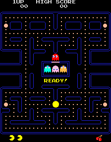

# Pac-Man

The goal of this project is to recreate the original [Pac-Man video game](https://en.wikipedia.org/wiki/Pac-Man):



## Game mechanics

Play the [Google Doodle version of Pac-Man](https://www.google.com/search?q=google+doodle+pacman) to see approximately how the game works.

In the original game, each ghost has a different strategy:

- Blinky (red) chases Pac-Man
- Inky (cyan) and Pinky (pink) try to get ahead of Pac-Man
- Clyde (orange) alternates between chasing Pac-Man and fleeing from him

Eating a power pellet causes the ghosts to turn blue, slow down, and reverse direction. Pac-Man can eat blue ghosts. Eating a ghost causes its eyes to dart back to the central box, and the ghost is restored to normal. After a while, blue ghosts flash white and eventually return to normal.

A bonus item appears after 70 Pac-Dots are eaten, and another after 170 Pac-Dots are eaten. They disappear if they are not eaten within 10 seconds.

Tunnels on the left and right allow Pac-Man and the ghosts to move to the opposite side of the maze. Ghosts normally move slightly faster than Pac-Man, but they slow down while traveling through these tunnels.

## Scoring

- Pac-Dots: 10 points each
- Power pellets: 50 points each
- Ghosts (after eating a power pellet)
  - 1st ghost: 200 points
  - 2nd ghost: 400 points
  - 3rd ghost: 800 points
  - 4th ghost: 1600 points
- Bonus items
  - Cherry: 100 points
  - Strawberry: 300 points
  - Orange: 500 points
  - Apple: 700 points
  - Melon: 1000 points
  - Galaxian: 2000 points
  - Bell: 3000 points
  - Key: 5000 points

## Lives

Pac-Man starts with three lives (one being played plus two in reserve) and earns an extra life for every 10,000 points scored.

## Getting started

The following steps assume you'll be creating a web application using Node.js, Vite, TypeScript, Lit, and Web Components. You can choose other technologies if you want.

- Install [Node.js](https://nodejs.org/en).

- Create a project using the Vite build tool:

  ```sh
  npm create vite@latest pac-man -- --template lit-ts --no-interactive
  cd pac-man
  npm install
  ```

- Develop and run the project:

  ```sh
  npm run dev
  ```

- Use the provided `maze.txt` file as a starting point for drawing the maze.

## Suggested steps

You can break down the problem however you'd like and accomplish tasks in any order, but here are some suggestions:

- Render the maze.
- Add Pac-Man and allow the user to move him through the maze.
- Animate Pac-Man's eating motion.
- Make Pac-Man consume Pac-Dots and Power Pills as he moves.
- Update the score as items are consumed.
- Add ghosts with their individual strategies for pursuing Pac-Man.
- Animate the ghosts as they move.
- Change ghost appearance and behavior when Pac-Man eats a Power Pill.
- Detect when Pac-Man hits a ghost. Make Pac-Man die or eat the ghost.
- Add transitional states: the "ready" state before gameplay starts, the animation when a level is completed, the animation when Pac-Man dies, and the "game over" state when all lives are used up.
- Add audio.